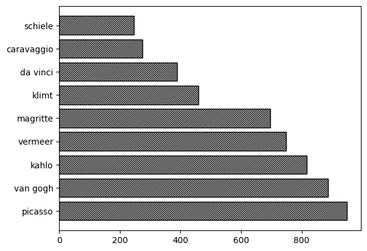

# Le mème du tableau vivant
Annexe à l'article *Le mème du tableau vivant à l’ère du confinement. Viralité et vitalité*, Créac'h, M. et Mazoyer, B., 2024.

Cette annexe contient :
* [tussenkunstenquarantaine_and_gettymuseumchallenge_insta_posts.csv](tussenkunstenquarantaine_and_gettymuseumchallenge_insta_posts.csv) : l'ensemble des urls des 79 957 posts Instagram étudiés dans l'article, ainsi que l'url de la première image de chaque post;
* [painters.csv](painters.csv) : les 10 peintres apparaissant le plus fréquemment dans les 100 premières entités nommées du corpus, dans toutes les langues;
* [descriptive_statistics.ipynb](descriptive_statistics.ipynb) : le code Python utilisé pour détecter la langue des posts, détecter les entités nommées et produire des statistiques sur ces données, notamment l'histogramme ci-dessous :

 **Nombre d'occurrences des noms de peintres les plus cités dans les textes du corpus**
 